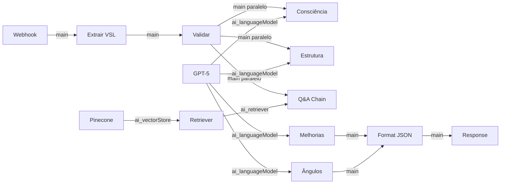

# 📚 Documentação Completa dos Nodes - Clone Digital Eugene Schwartz

## 📋 Índice dos Nodes

### Pipeline de Vetorização
1. [Manual Trigger - Iniciar Vetorização](#1-manual-trigger---iniciar-vetorização)
2. [Configurar PDF Eugene Schwartz](#2-configurar-pdf-eugene-schwartz)
3. [Baixar Livro Breakthrough Advertising](#3-baixar-livro-breakthrough-advertising)
4. [Document Loader - PDF Parser](#4-document-loader---pdf-parser)
5. [Text Splitter - Chunks Otimizados](#5-text-splitter---chunks-otimizados)
6. [OpenAI Embeddings - Vetorização](#6-openai-embeddings---vetorização)
7. [Pinecone Insert - Armazenar Conhecimento](#7-pinecone-insert---armazenar-conhecimento)

### Pipeline de Análise
8. [Webhook - Receber VSL para Análise](#8-webhook---receber-vsl-para-análise)
9. [Extrair e Validar VSL Input](#9-extrair-e-validar-vsl-input)
10. [Validar Tipo de Análise](#10-validar-tipo-de-análise)
11. [Análise Nível de Consciência](#11-análise-nível-de-consciência)
12. [Análise Estrutural da Copy](#12-análise-estrutural-da-copy)
13. [Q&A Chain - Buscar Princípios Relevantes](#13-qa-chain---buscar-princípios-relevantes)
14. [Vector Store Retriever](#14-vector-store-retriever---buscar-conhecimento-eugene)
15. [Pinecone Read - Recuperar Princípios](#15-pinecone-read---recuperar-princípios)
16. [OpenAI Embeddings - Query](#16-openai-embeddings---query)
17. [OpenAI GPT-5 - Motor de Análise](#17-openai-gpt-5---motor-de-análise)
18. [Gerar 5 Pontos de Melhoria](#18-gerar-5-pontos-de-melhoria)
19. [Criar 3 Novos Ângulos](#19-criar-3-novos-ângulos)
20. [Formatar Resposta JSON Final](#20-formatar-resposta-json-final)
21. [Webhook Response - Análise Completa](#21-webhook-response---análise-completa)

---

## 🔧 Pipeline de Vetorização

### 1. Manual Trigger - Iniciar Vetorização

**Tipo:** `n8n-nodes-base.manualTrigger`

**Função:** Inicia manualmente o processo de vetorização do livro. Executado apenas uma vez durante a configuração inicial.

**Configuração:**
```yaml
Nenhuma configuração necessária - node padrão
```

**Como usar:**
1. Clique no node
2. Clique em "Execute Node"
3. O processo de vetorização iniciará

**Output:** Trigger vazio que inicia o fluxo

---

### 2. Configurar PDF Eugene Schwartz

**Tipo:** `n8n-nodes-base.set`

**Função:** Define o caminho ou URL do PDF do livro "Breakthrough Advertising" que será processado.

**Configuração:**
```javascript
{
  "assignments": {
    "assignments": [
      {
        "name": "pdf_path",
        "type": "string",
        "value": "/path/to/breakthrough-advertising.pdf"
        // OU
        "value": "https://drive.google.com/file/d/FILE_ID/view"
      }
    ]
  }
}
```

**Campos importantes:**
- `pdf_path`: Caminho local ou URL do Google Drive do PDF

**⚠️ Atenção:** Você deve ter uma cópia legal do livro. Não fornecemos o PDF.

**Output:** 
```json
{
  "pdf_path": "caminho_configurado"
}
```

---

### 3. Baixar Livro Breakthrough Advertising

**Tipo:** `n8n-nodes-base.googleDrive`

**Função:** Baixa o PDF do Google Drive para processamento.

**Configuração:**
```javascript
{
  "operation": "download",
  "fileId": {
    "__rl": true,
    "mode": "id",
    "value": "={{ $json.pdf_path }}"
  }
}
```

**Credenciais necessárias:**
1. Vá em Credentials → New
2. Escolha "Google Drive OAuth2 API"
3. Siga o processo de autenticação
4. Nomeie como "Google Drive account"

**Alternativa para arquivo local:**
Substitua este node por `Read Binary File`:
```javascript
{
  "filePath": "/caminho/local/arquivo.pdf"
}
```

**Output:** Arquivo binário do PDF

---

### 4. Document Loader - PDF Parser

**Tipo:** `@n8n/n8n-nodes-langchain.documentDefaultDataLoader`

**Função:** Converte o PDF binário em documento de texto processável para o sistema de IA.

**Configuração:**
```javascript
{
  "dataType": "binary",
  "options": {
    "metadata": {
      "source": "breakthrough_advertising",
      "author": "Eugene Schwartz"
    }
  }
}
```

**Conexões importantes:**
- **Input:** Recebe arquivo binário do node anterior
- **Output para:** Text Splitter (via porta `ai_textSplitter`)

**Output:** Documento de texto extraído do PDF

---

### 5. Text Splitter - Chunks Otimizados

**Tipo:** `@n8n/n8n-nodes-langchain.textSplitterRecursiveCharacterTextSplitter`

**Função:** Divide o texto do livro em chunks menores para vetorização eficiente.

**Configuração:**
```javascript
{
  "chunkSize": 2000,      // Tamanho de cada chunk em caracteres
  "chunkOverlap": 300     // Sobreposição entre chunks
}
```

**Por que estes valores?**
- `2000 chars`: Balanceia contexto vs custo de embedding
- `300 overlap`: Mantém continuidade semântica entre chunks

**Ajustes recomendados:**
- **Mais precisão:** chunkSize: 1500, overlap: 400
- **Mais velocidade:** chunkSize: 3000, overlap: 200

**Output:** Array de chunks de texto

---

### 6. OpenAI Embeddings - Vetorização

**Tipo:** `@n8n/n8n-nodes-langchain.embeddingsOpenAi`

**Função:** Converte cada chunk de texto em vetores numéricos de 1536 dimensões.

**Configuração:**
```javascript
{
  "options": {
    "model": "text-embedding-ada-002",  // Modelo padrão
    "batchSize": 512,                    // Processar em lotes
    "stripNewlines": true                // Limpar quebras de linha
  }
}
```

**Credenciais necessárias:**
1. Credentials → New → OpenAI API
2. Inserir API Key: `sk-...`
3. Nomear como "OpenAI account"

**Custos:** ~$0.0001 por 1000 tokens

**Output:** Vetores de 1536 dimensões para cada chunk

---

### 7. Pinecone Insert - Armazenar Conhecimento

**Tipo:** `@n8n/n8n-nodes-langchain.vectorStorePinecone`

**Função:** Armazena os vetores e textos no banco de dados vetorial Pinecone.

**Configuração:**
```javascript
{
  "mode": "insert",
  "pineconeIndex": {
    "__rl": true,
    "mode": "list",
    "value": "eugene-schwartz-index"
  },
  "options": {
    "clearNamespace": true,  // Limpa dados anteriores
    "namespace": "default"    // Namespace para organização
  }
}
```

**Setup Pinecone:**
1. Criar conta em pinecone.io
2. Criar index:
   ```
   Name: eugene-schwartz-index
   Dimensions: 1536
   Metric: cosine
   ```
3. Copiar API Key e Environment

**Credenciais:**
```javascript
{
  "apiKey": "xxxxxxxx-xxxx-xxxx-xxxx",
  "environment": "us-east-1-aws"
}
```

**Output:** Confirmação de inserção dos vetores

---

## 🔄 Pipeline de Análise

### 8. Webhook - Receber VSL para Análise

**Tipo:** `n8n-nodes-base.webhook`

**Função:** Endpoint HTTP que recebe a VSL para análise via API.

**Configuração:**
```javascript
{
  "httpMethod": "POST",
  "path": "analyze-vsl-copy",
  "responseMode": "responseNode",  // Resposta no final do workflow
  "options": {
    "responseHeaders": {
      "Content-Type": "application/json"
    }
  }
}
```

**URL do Webhook:**
```
POST https://seu-n8n.com/webhook/[WEBHOOK_ID]/analyze-vsl-copy
```

**Request esperado:**
```json
{
  "vsl_copy": "Texto da lead de VSL aqui..."
}
```

**Como testar:**
1. Clique no node
2. Clique em "Listen for Test Event"
3. Envie um POST com a VSL
4. Clique em "Stop Listening"

---

### 9. Extrair e Validar VSL Input

**Tipo:** `n8n-nodes-base.code`

**Função:** Valida e extrai a VSL do request, preparando para análise.

**Código JavaScript:**
```javascript
// Extrair e validar input da VSL
const vslCopy = $input.all()[0].json.vsl_copy || 
                 $input.all()[0].json.body?.vsl_copy;

if (!vslCopy) {
  throw new Error('VSL copy não fornecida. Envie no formato {"vsl_copy": "seu texto aqui"}');
}

// Validar tamanho mínimo
if (vslCopy.length < 100) {
  throw new Error('VSL muito curta. Mínimo 100 caracteres.');
}

// Preparar contexto para análise
return [{
  json: {
    vsl_copy: vslCopy,
    timestamp: new Date().toISOString(),
    analysis_type: 'eugene_schwartz_methodology',
    char_count: vslCopy.length
  }
}];
```

**Output esperado:**
```json
{
  "vsl_copy": "texto validado",
  "timestamp": "2024-12-XX",
  "analysis_type": "eugene_schwartz_methodology",
  "char_count": 1500
}
```

---

### 10. Validar Tipo de Análise

**Tipo:** `n8n-nodes-base.if`

**Função:** Verifica se a análise solicitada é do tipo Eugene Schwartz (permite futuras expansões).

**Configuração:**
```javascript
{
  "conditions": {
    "string": [
      {
        "value1": "={{ $json.analysis_type }}",
        "operation": "equals",
        "value2": "eugene_schwartz_methodology"
      }
    ]
  }
}
```

**Branches:**
- **True:** Continua para análise
- **False:** Poderia redirecionar para outro tipo de análise

---

### 11. Análise Nível de Consciência

**Tipo:** `@n8n/n8n-nodes-langchain.chainLlm`

**Função:** Analisa qual dos 5 níveis de consciência a copy está mirando.

**Configuração:**
```javascript
{
  "promptType": "define",
  "text": "={{ $json.vsl_copy }}",
  "options": {
    "systemMessage": `Você é Eugene Schwartz...
    
    Os 5 Níveis de Consciência são:
    1. Mais Consciente: Conhece seu produto e só precisa de um bom negócio
    2. Consciente do Produto: Conhece o produto mas não está convencido
    3. Consciente da Solução: Sabe que existe solução mas não conhece seu produto
    4. Consciente do Problema: Sente o problema mas não sabe que existe solução
    5. Inconsciente: Não sabe que tem um problema
    
    Analise a copy e identifique:
    - Qual nível de consciência ela está mirando
    - Se está adequada para esse nível
    - Problemas na abordagem`,
    
    "temperature": 0.3,  // Baixa para consistência
    "maxCompletionTokens": 1000
  }
}
```

**Output esperado:**
```text
"A copy está mirando o Nível 3 (Consciente da Solução) pois..."
```

---

### 12. Análise Estrutural da Copy

**Tipo:** `@n8n/n8n-nodes-langchain.chainLlm`

**Função:** Identifica o framework usado (PAS, AIDA, etc.) e avalia elementos estruturais.

**Configuração:**
```javascript
{
  "promptType": "define",
  "text": "={{ $json.vsl_copy }}",
  "options": {
    "systemMessage": `Como Eugene Schwartz, analise a estrutura e identifique:
    
    1. Framework usado: PAS, AIDA, BAB, PASTOR
    2. Elementos presentes:
       - Headline principal
       - Lead (primeiras linhas)
       - Promessa principal
       - Prova social
       - Garantias
       - Call to action
    3. Qualidade da execução`,
    
    "temperature": 0.3,
    "maxCompletionTokens": 1000
  }
}
```

---

### 13. Q&A Chain - Buscar Princípios Relevantes

**Tipo:** `@n8n/n8n-nodes-langchain.chainRetrievalQa`

**Função:** Busca no conhecimento vetorizado princípios relevantes do livro para a VSL.

**Configuração:**
```javascript
{
  "query": "={{ $json.vsl_copy }}",
  "options": {
    "topK": 5,  // Buscar 5 chunks mais relevantes
    "systemMessageTemplate": `Use os princípios de Eugene Schwartz 
                              para analisar esta copy`
  }
}
```

**Conexões necessárias:**
- **Language Model:** GPT-5
- **Retriever:** Vector Store Retriever

---

### 14. Vector Store Retriever - Buscar Conhecimento Eugene

**Tipo:** `@n8n/n8n-nodes-langchain.retrieverVectorStore`

**Função:** Interface para buscar informações relevantes no banco vetorial.

**Configuração:**
```javascript
{
  "topK": 5,           // Número de resultados
  "minScore": 0.7      // Similaridade mínima
}
```

**Conexão:** Liga o Q&A Chain ao Pinecone Read

---

### 15. Pinecone Read - Recuperar Princípios

**Tipo:** `@n8n/n8n-nodes-langchain.vectorStorePinecone`

**Função:** Lê vetores relevantes do Pinecone baseado na query.

**Configuração:**
```javascript
{
  "pineconeIndex": {
    "__rl": true,
    "mode": "list",
    "value": "eugene-schwartz-index"
  },
  "namespace": "default"
}
```

**Usa as mesmas credenciais do Pinecone Insert**

---

### 16. OpenAI Embeddings - Query

**Tipo:** `@n8n/n8n-nodes-langchain.embeddingsOpenAi`

**Função:** Converte a pergunta/VSL em vetor para busca semântica.

**Configuração:**
```javascript
{
  "options": {
    "model": "text-embedding-ada-002"
  }
}
```

**Importante:** Deve usar o mesmo modelo usado na vetorização

---

### 17. OpenAI GPT-5 - Motor de Análise

**Tipo:** `@n8n/n8n-nodes-langchain.lmChatOpenAi` (compatível com Responses API)

**Função:** Modelo de linguagem principal que executa todas as análises.

**Configuração (Responses API / GPT‑5):**
```javascript
{
  "model": "gpt-5",
  "options": {
    "temperature": 0.3,                 // Baixa para consistência
    "maxCompletionTokens": 2000,        // GPT‑5 usa max_completion_tokens
    "reasoning": { "effort": "medium" },
    "text": { "verbosity": "low" },
    "topP": 0.9,
    "frequencyPenalty": 0,
    "presencePenalty": 0
  }
}
```

**Modelos disponíveis (série GPT‑5):**
- `gpt-5`: raciocínio complexo, melhor qualidade geral
- `gpt-5-mini`: custo/latência menores com bom raciocínio
- `gpt-5-nano`: throughput alto para tarefas simples

**Este node conecta a TODOS os chains de análise**

---

### 18. Gerar 5 Pontos de Melhoria

**Tipo:** `@n8n/n8n-nodes-langchain.chainLlm`

**Função:** Gera exatamente 5 melhorias específicas baseadas nas análises anteriores.

**Configuração:**
```javascript
{
  "promptType": "define",
  "text": `VSL: {{ $node['Extrair e Validar VSL Input'].json.vsl_copy }}
           Consciência: {{ $node['Análise Nível de Consciência'].json.output }}
           Estrutura: {{ $node['Análise Estrutural da Copy'].json.output }}`,
  
  "options": {
    "systemMessage": `Como Eugene Schwartz, identifique EXATAMENTE 5 pontos:
    
    Para cada ponto:
    1. O que está errado (cite trecho)
    2. Por que é um problema
    3. Como consertar
    4. Exemplo reescrito
    
    Seja cirúrgico e prático.`,
    
    "temperature": 0.3
  }
}
```

**Referências de nodes:**
- Usa output da análise de consciência
- Usa output da análise estrutural

---

### 19. Criar 3 Novos Ângulos

**Tipo:** `@n8n/n8n-nodes-langchain.chainLlm`

**Função:** Cria 3 abordagens alternativas para diferentes níveis de consciência.

**Configuração:**
```javascript
{
  "promptType": "define",
  "text": "Nível atual: {{ $node['Análise Nível de Consciência'].json.output }}",
  
  "options": {
    "systemMessage": `Crie EXATAMENTE 3 novos ângulos:
    
    1. Para Consciente da Solução (Nível 3)
    2. Para Consciente do Problema (Nível 2)  
    3. Para Consciente do Produto (Nível 4)
    
    Para cada:
    - Headline (máx 15 palavras)
    - Lead (3-4 linhas)
    - Justificativa baseada em Breakthrough Advertising`,
    
    "temperature": 0.5  // Um pouco mais criativo
  }
}
```

---

### 20. Formatar Resposta JSON Final

**Tipo:** `n8n-nodes-base.code`

**Função:** Compila todas as análises em JSON estruturado conforme especificação.

**Código JavaScript (resumido):**
```javascript
// Coletar outputs de todos os nodes
const consciousnessAnalysis = $node['Análise Nível de Consciência'].json.output;
const structuralAnalysis = $node['Análise Estrutural da Copy'].json.output;
const improvements = $node['Gerar 5 Pontos de Melhoria'].json.output;
const newAngles = $node['Criar 3 Novos Ângulos'].json.output;

// Funções de parsing (extractConsciousnessLevel, parseImprovements, etc.)

// Compilar resposta final
const response = {
  analise_nivel_consciencia: {
    nivel_identificado: extractConsciousnessLevel(consciousnessAnalysis),
    justificativa: consciousnessAnalysis,
    adequacao: "Adequada" // ou "Necessita ajustes"
  },
  
  estrutura_copy: {
    framework_usado: identifyFramework(structuralAnalysis),
    elementos_identificados: [...],
    analise_detalhada: structuralAnalysis
  },
  
  pontos_melhoria: parseImprovements(improvements),
  
  novos_angulos: parseAngles(newAngles),
  
  metadata: {
    timestamp: new Date().toISOString(),
    modelo_usado: "GPT-5 + Eugene Schwartz RAG",
    versao: "1.0.0"
  },
  
  resumo_executivo: {
    nota_geral: 7,
    principal_problema: "...",
    principal_oportunidade: "...",
    proximos_passos: [...]
  }
};

return [{json: response}];
```

**Validações incluídas:**
- Garante 5 melhorias
- Garante 3 ângulos
- Trata valores undefined
- Formata JSON corretamente

---

### 21. Webhook Response - Análise Completa

**Tipo:** `n8n-nodes-base.respondToWebhook`

**Função:** Retorna o JSON formatado como resposta do webhook.

**Configuração:**
```javascript
{
  "respondWith": "json",
  "responseBody": "={{ JSON.stringify($json, null, 2) }}",
  "options": {
    "responseCode": 200,
    "responseHeaders": {
      "entries": [
        {
          "name": "Content-Type",
          "value": "application/json"
        },
        {
          "name": "X-Powered-By",
          "value": "Eugene-Schwartz-AI"
        }
      ]
    }
  }
}
```

**Códigos de resposta:**
- `200`: Sucesso
- `400`: Input inválido
- `500`: Erro interno

---

## 🔌 Conexões Entre Nodes

### Tipos de Conexões:

1. **main** - Fluxo principal de dados
2. **ai_document** - Documentos processados
3. **ai_textSplitter** - Divisor de texto
4. **ai_embedding** - Vetores de embedding
5. **ai_vectorStore** - Armazenamento vetorial
6. **ai_languageModel** - Modelo de linguagem
7. **ai_retriever** - Recuperador de informações

### Mapa de Conexões Críticas:



---

## 🛠️ Troubleshooting por Node

### Problemas Comuns:

**Node não executa:**
- Verificar conexões de entrada
- Confirmar credenciais configuradas
- Checar logs do n8n

**Output vazio:**
- Aumentar timeout do node
- Verificar prompt/configuração
- Testar com input menor

**Erro de credenciais:**
- Re-autenticar OAuth (Google)
- Verificar API key (OpenAI/Pinecone)
- Confirmar environment (Pinecone)

**Rate limits:**
- Adicionar node Wait entre chamadas
- Reduzir batchSize
- Usar cache quando possível

---

## 📊 Monitoramento e Otimização

### KPIs por Node:

| Node | Métrica | Ideal | Alerta |
|------|---------|-------|--------|
| Webhook | Latência | <100ms | >500ms |
| Embeddings | Tokens/seg | >1000 | <500 |
| GPT-5 | Tempo resposta | <5s | >15s |
| Pinecone | Query time | <200ms | >1s |
| Total workflow | Execução | <30s | >60s |

### Otimizações Recomendadas:

1. **Cache de embeddings**: Reutilizar vetores frequentes
2. **Batch processing**: Processar múltiplas VSLs
3. **Fallback models**: gpt-5-mini ou gpt-4.1 se gpt-5 falhar
4. **Retry logic**: Retentar nodes com falha
5. **Load balancing**: Múltiplas API keys

---

## 📝 Checklist de Configuração

### Antes de executar:

- [ ] Pinecone index criado (1536 dims)
- [ ] OpenAI API key configurada
- [ ] PDF do livro disponível
- [ ] Credenciais testadas
- [ ] Webhook URL anotada

### Primeira execução:

- [ ] Executar vetorização (1x apenas)
- [ ] Verificar inserção no Pinecone
- [ ] Testar webhook com VSL simples
- [ ] Validar formato JSON de saída
- [ ] Documentar tempo de execução

### Produção:

- [ ] Rate limiting configurado
- [ ] Monitoring ativo
- [ ] Backup do workflow
- [ ] Logs habilitados
- [ ] Alertas configurados

---

*Esta documentação é parte do projeto Clone Digital Eugene Schwartz para Vitascience*